# Practica_master_slave

Este repositorio contiene la práctica de despliegue de aplicaciones web con configuración de DNS.

1. Se inicializó el archivo `Vagrantfile` utilizando el comando `vagrant init`.
2. Las máquinas virtuales fueron configuradas según las indicaciones del ejercicio 2. Se emplearon contenedores de Vagrant, específicamente bullseye64. A cada máquina se le asignó un nombre de host, una IP fija y se incluyó un script de provisión que actualiza la VM e instala las herramientas necesarias para la configuración del DNS.

3. En la máquina `Tierra`, se configuró el archivo `named.conf.options` con los siguientes ajustes:
   1. Deshabilitar la escucha en direcciones IPv6.
   2. Permitir consultas desde la red interna.
   3. Habilitar consultas recursivas.
   4. Activar DNSSEC.
   5. Establecer la dirección `208.67.222.222` para el reenvío de consultas.

   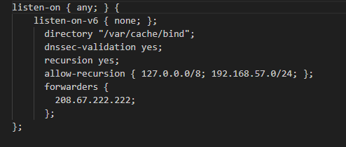

4. Se editó el archivo `named.conf.local` en `Tierra`, otorgándole autoridad sobre las zonas directa e inversa.

   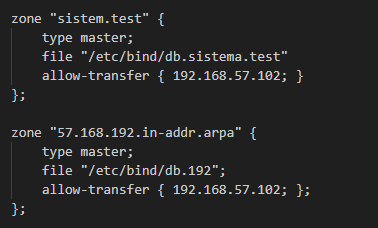

5. Se crearon y configuraron los archivos `db.sistema.test` y `db.192`, donde se definieron los detalles de las zonas y los puertos para las conexiones.

   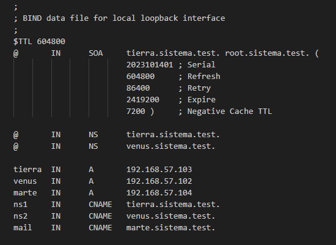

   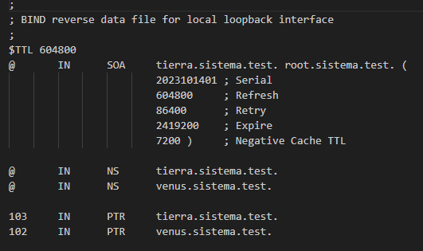

6. Luego de configurar la máquina `Tierra`, se procedió a configurar el DNS en la máquina `Venus`. Se modificó el archivo `named.conf.local` para añadir la configuración de las zonas directa e inversa.

   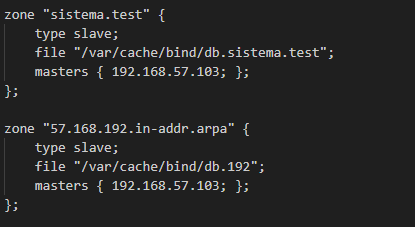

7. Una vez completada la edición de los archivos, se ajustó la provisión de cada VM para copiar los archivos a los directorios correspondientes, garantizando que el sistema pueda replicarse en otros entornos. Se añadieron líneas de código en los scripts de provisión para automatizar este proceso.

8. Finalmente, se llevaron a cabo las comprobaciones requeridas en la práctica para verificar la correcta configuración del DNS.

   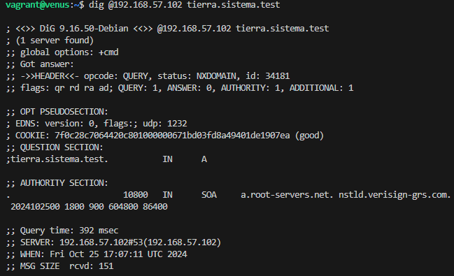

   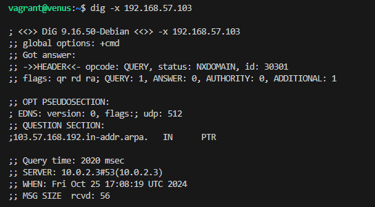

   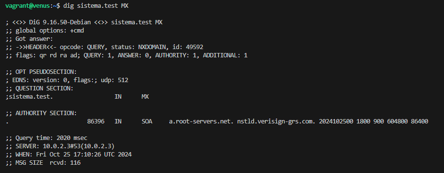

   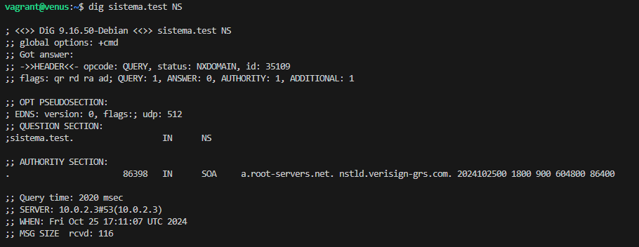

   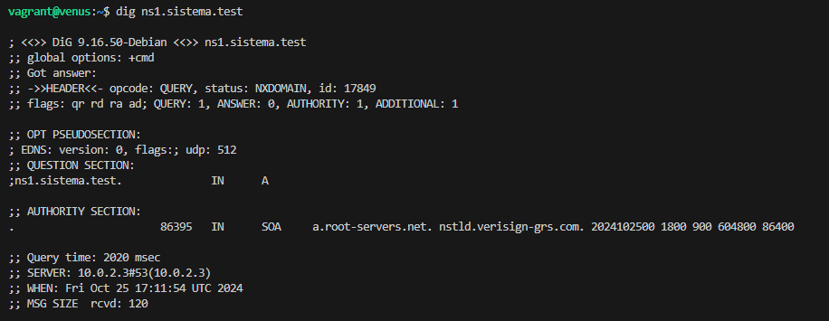

   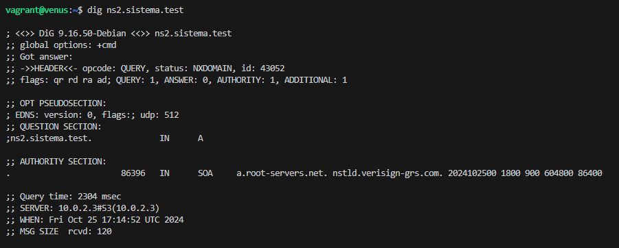

   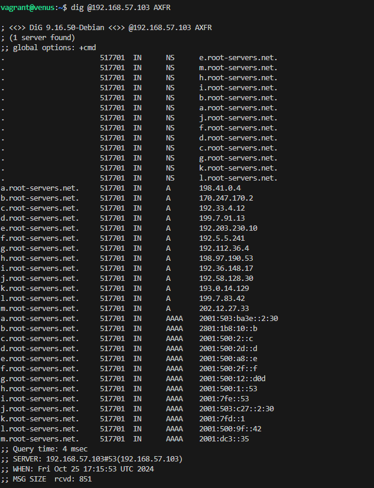